## YSG

ML Engineer focused on MLOps, model serving, and automation.

### Skills 🔧

- **Languages**: Python  
- **ML/DL**: PyTorch, Computer Vision  
- **Backend**: FastAPI  
- **MLOps**: Docker

### Github Stats 📊

### Top Languages 📊

### Featured Project 📖

### Contact ☎️

